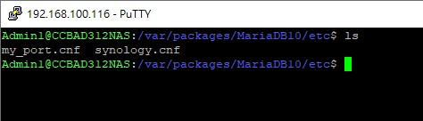

# 自定marial db 的功能
+ cd到 /var/packages/MariaDB10/etc
若 MariaDB 資料夾中沒有 my.cnf，請建立名為 my.cnf 的設定檔。
+ 

+ 輸入 sudo vi /var/packages/MariaDB10/etc/my.cnf 建立my.cnf
+ [vi和vim指令教學] sudo vi /var/packages/MariaDB10/etc/my.cnf
+ 在.my.cnf輸入下面的內容
  - [mysqld]
  - character-set-server=utf8
   - collation-server=utf8_general_ci
  - [client]
  - default-character-set=utf8
  - [mysql]
  - default-character-set=utf8
  - user="root"
  - password=""
